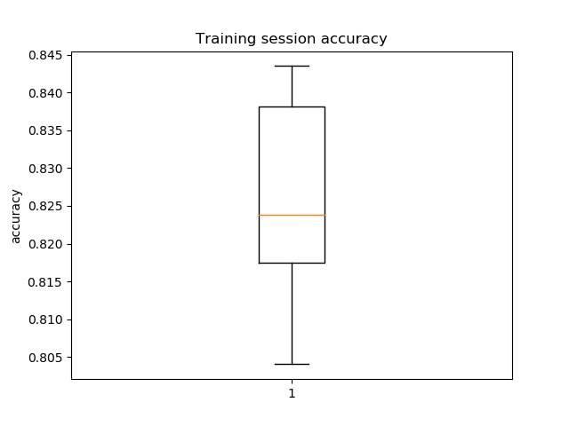
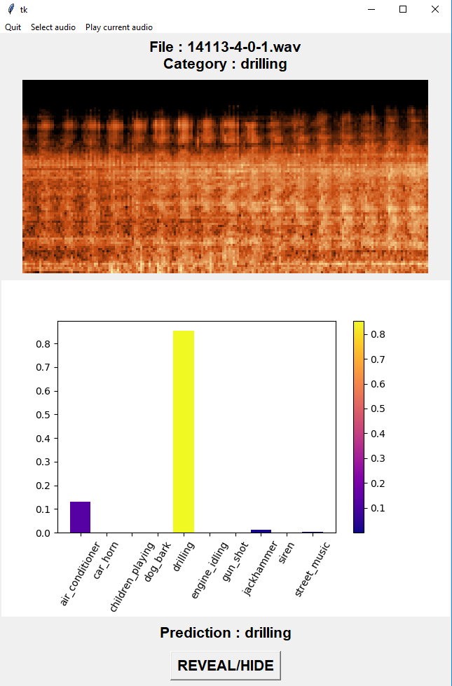

# Urban Sound Classification Keras  

Neural network on urban sound classification task using Keras.  
You can find the public dataset used for this project [here](https://urbansounddataset.weebly.com/).  

## Results
Used data-augmentations for final result : white noise.  
On 10 trainings, the network achieve a **maximum accuracy of 84.3%** with a mean accuracy of 82.6% (min 80.4%).  

On the 8732 urban sounds, 10% were used as validation data. The augmented files that were generated from these 10% were
 not used for training (nor for validation).
 
 ## GUI
 
 Run the **use_network.py** script to use a simple GUI in order to test the network.
 
 Be careful, it could sting your eyes, but it does the job :
 - You can select an audio file.
 - You can run the audio file.
 - The associated spectrogram is computed and displayed.
 - The network prediction is displayed.
 - You can challenge colleagues or friends to do better than the network by hiding the spectrogram and prediction.
 
 
 
 ## TODO
 - Test other data augmentations (some are already implemented in the code but not yet tested).
 - Try RNN architectures (LSTM or GRU)
 - Try different technics for audio filtering (many audio files contain parasite noises that are sometimes far louder than the file's sound category).

## Libraries
- tensorflow[-gpu]
- keras
- librosa
- numpy
- matplotlib
- sklearn
- pillow

## Notes

On a laptop with a GTX 1080 : approximately 40 minutes for 200 iterations.